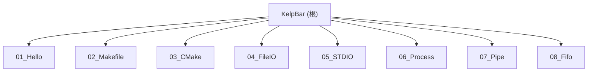

# KelpBar

## 项目愿景

KelpBar 是一个 Linux 系统编程渐进式学习项目。通过 8 个编号递进的学习模块，从最基础的 Hello World 到进程间通信（管道、命名管道），系统性地掌握 C 语言在 Linux 环境下的系统级编程技能。每个模块都是独立的、可编译运行的示例项目，配有详细注释和学习笔记。

## 架构总览

- **语言**：C（C99/C11 标准），全部为单文件或少量文件的演示程序
- **构建工具**：从手动 gcc 命令 -> Makefile -> CMake 渐进演进
- **运行平台**：Linux（依赖 POSIX API：`unistd.h`、`fcntl.h`、`sys/wait.h` 等）
- **项目类型**：学习/教学项目，无第三方依赖，无库/框架
- **代码风格**：中文注释为主，每个源文件内嵌 API 文档说明

### 模块结构图



## 模块索引

| 序号 | 模块路径 | 主题 | 一句话职责 | 构建方式 |
|------|----------|------|-----------|----------|
| 01 | `01_Hello/` | Hello World | 最简 C 程序：多文件编译入门，学习 gcc 手动编译流程 | 手动 gcc |
| 02 | `02_Makefile/` | Makefile 构建 | 学习 Makefile 自动化编译，含初版与优化版两套 Makefile | Makefile |
| 03 | `03_CMake/` | CMake 构建 | 学习 CMake 跨平台构建系统，含三种编译方式对比文档 | CMake |
| 04 | `04_FileIO/` | Linux 文件 I/O | 使用系统调用 `open/read/write/lseek/close` 进行文件操作 | CMake |
| 05 | `05_STDIO/` | 标准 I/O | 使用 C 标准库 `fopen/fwrite/fread/fseek/fclose` 进行文件操作，含 fwrite 踩坑记录 | CMake |
| 06 | `06_Process/` | 进程管理 | 学习 `fork/exec/waitpid` 进程创建、程序替换与进程监控（看门狗模式） | CMake |
| 07 | `07_Pipe/` | 匿名管道 | 学习匿名管道（pipe）实现父子进程间单向和双向通信 | CMake |
| 08 | `08_Fifo/` | 命名管道 | 学习命名管道（FIFO/mkfifo）实现进程间通信，含循环读取和缓冲区管理 | CMake |

## 运行与开发

### 通用编译流程（适用于 03-08 模块）

```bash
cd <模块目录>
mkdir -p build && cd build
cmake ..
make
./<可执行文件名>
```

### 01_Hello 手动编译

```bash
cd 01_Hello
gcc -c main.c -o main.o
gcc -c utils.c -o utils.o
gcc main.o utils.o -o hello
./hello
```

### 02_Makefile 构建

```bash
cd 02_Makefile
make
./hello
make clean
```

### 外部参考资料

- [man7.org Linux man pages](https://www.man7.org/linux/man-pages/index.html) -- 官方 API 手册
- [Linux API 速查手册](https://www.bookstack.cn/read/linuxapi/POSIX-IO) -- 第三方中文手册
- [小智学长 Linux 文件 IO](https://x509p6c8to.feishu.cn/docx/GanSd5WxyoqU7gxhSM3cOb7hngc) -- 飞书教程

## 测试策略

本项目为学习项目，暂无自动化测试。各模块通过手动编译运行验证正确性。建议的验证方式：

- 每个模块编译无 warning、无 error
- 运行输出与源码注释中的预期一致
- 04/05 模块可检查生成的 `example.txt` 文件内容

## 编码规范

- **语言标准**：C99 及以上
- **命名风格**：snake_case（函数与变量）
- **注释**：中文注释为主，关键 API 调用前有参数说明注释
- **头文件保护**：使用 `#ifndef __XXX_H / #define __XXX_H / #endif` 模式
- **错误处理**：系统调用返回值均有 -1 检查，使用 `perror` 输出错误信息
- **构建规范**：03 及以后模块统一使用 CMake，推荐 out-of-source 构建（`build/` 子目录）

## AI 使用指引

- 修改代码时注意保持中文注释风格
- 新增模块建议遵循 `XX_模块名/` 的编号目录结构
- 每个模块应包含 `CMakeLists.txt`（04 之后的模块）或 `Makefile`（02 模块）
- 源文件中内嵌的 API 文档注释是重要的学习笔记，不要删除
- `build/` 目录和 `*.o` 文件为构建产物，不应纳入版本控制

## 变更记录 (Changelog)

| 日期 | 操作 | 说明 |
|------|------|------|
| 2026-05-20 | 初始化 | 由架构扫描工具自动生成，覆盖全部 8 个模块 |
